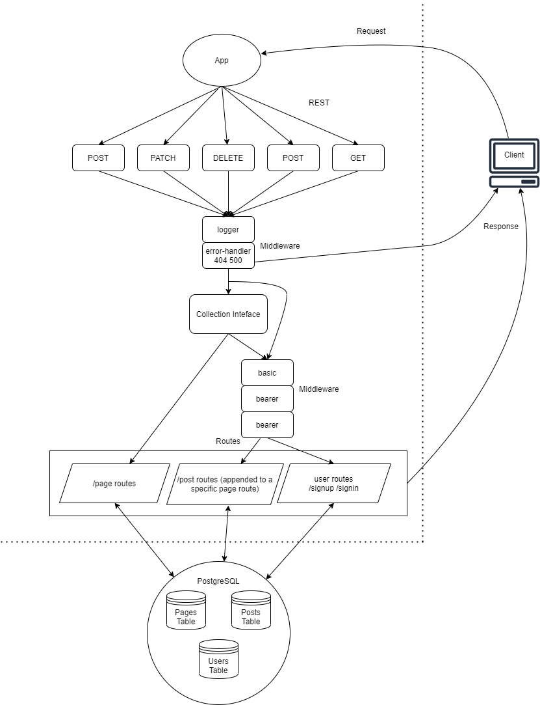

# Blog Auth API

## Installation

  clone repo, and then in a terminal run the 'npm i' command while in the root directory to install dependencies.
  
  To run the application, enter the 'npm run start' command in a terminal while in the root directory.

## About the Application

  This auth api will provide the backend for an app that will allow users to create posts on certain pages, assuming they have the proper permissions given their role. Admins will be able to create pages for other users to add posts to.

## Summary of Problem Domain

  Create an auth api application that showcases event driving architecture. 
  
  Users will be able to create an account that will persist for future app visits

  Registered users will be able to login to their account so that they may access protected information

  App will have Proper CI/CD configuration

  A user will be able to obtain a token after they sign in, so that they can re-authenticated when certain actions are taken

  App shall have a route that only user with a valid token can use

  The JWT used in the application will be secured by 1+ methods

  Implement a Role Based Access Control system on the API using an Access Control List. 

## Links to application deployment

  App deployed on Heroku [here]()

  Pull req from dev found [here]()

## Uml Diagram

## Routes

* REST Method GET

  * Path: /page
    * returns all pages
    * requires read capability
  
  * Path: /page/:page_id
    * returns all articles for a specific page
    * requires read capability

  * Path: /page/:page_id/article/:id
    * get a specific article on a specific page
    * requires read capability

  * Path: /article
    * get all articles regardless of their page
    * requires read capability

* REST Method POST
  * Path: /signin
    * T\takes a request with an "Authorization" header with the value Basic TOKEN that contains a properly encoded username and password combination
    * returns the user's data and a JWT token as output after account creation, or a proper error response if the request wasn't successful

  * Path: /signup
    * takes a JSON obj or form data as input with user and password information
    * returns the user's data and a JWT token as output after a successful login attempt, or a proper error response if the request wasn't successful

  * Path: /page
    * creates a page of the supplied model
    * returns the created resource
    * requires create capability

  * Path: /page/:page_id
    * creates an article at the specified page
    * requires create capability

* REST Method PUT
  * Path: /page/:page_id
    * updates the specified page
    * returns the updated resource
    * requires update capability

  * Path: /page/:page_id/article/:id
    * updates the specified article
    * returns the updated resource
    * requires update capability

* REST Method DELETE
  * Path: /page/:page_id
    * deletes the specified page
    * returns an empty object if successful
    * requires delete capability

  * Path: /page/:page_id/article/:id
    * deletes the specified article
    * returns an empty object if successful
    * requires delete capability
